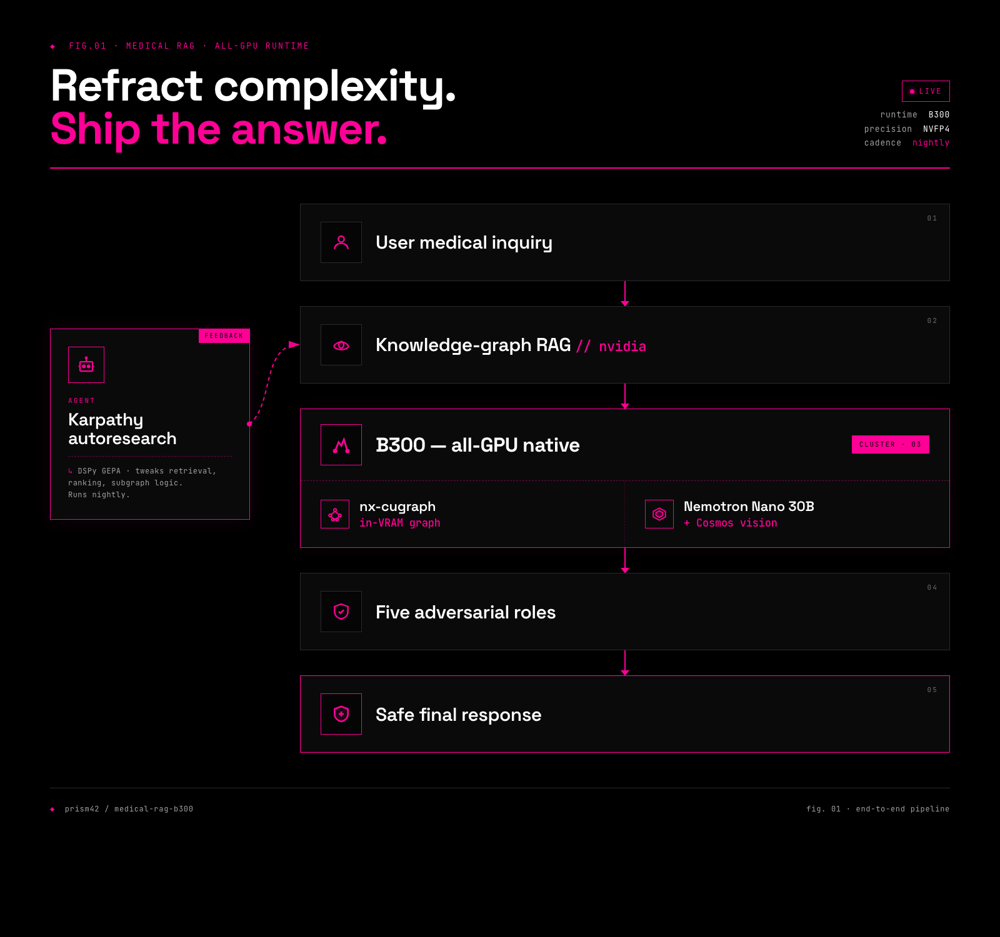

<p align="center">
  
</p>

# Prism42

**A full-stack trust-and-performance pipeline for high-stakes voice AI.
Find correctness failures. Optimize the compute path. Prove clinical-
reasoning lift. Deploy the agent stack. Package into a 911 call-center
demo anyone can interact with.**

Prism42 proves three things before the demo runs: the agents are
**correct**, they are **fast**, and they are **clinically safer than
baseline**. The pipeline is four stages composing into one deployable
system — see [`docs/pipeline-narrative.md`](docs/pipeline-narrative.md)
for the full thesis.

No speculative findings. No benchmark numbers we didn't measure
ourselves. Every claim on the landing page traces to a
session ID; every session ID reproduces with a shell command; every
agent the public talks to has an auditor running the same dialectic
that found the kernel bugs.

## Four stages, one pipeline

1. **Find correctness failures — kernel layer.** Five-role adversarial
   dialectic (defender / attacker / synthesizer / executor /
   adjudicator, coordinated) running as Anthropic Managed Agents on
   Claude Opus 4.7. Every finding compiles and runs on real GPU
   hardware before shipping. See `mla/` + `scripts/`.
2. **Optimize the compute path — inference layer.** Clean-process
   measurement rubric: fresh subprocess per run, 200 CUDA-event samples,
   3 replicates, full p10/p50/p90/p99 distribution. Six
   benchmark-gaming detectors (`mla/prism/gaming_patterns.py`). Six
   mechanisms counter the "AI-slop benchmark number" pattern.
3. **Prove clinical-reasoning lift — reasoning layer.** HealthBench Hard
   (OpenAI `simple-evals`, Apache 2.0, vendored) as the primary rubric
   grader. First public Opus 4.7 HealthBench Hard baseline: `0.196 ±
   0.068` (N = 3, 95 % CI, 30-example subset). Canonical 1000-example
   parent set pinned at `corpus/pins/healthbench-hard-1000.yaml`.
   Paired-design harness delta gates on CI-excludes-zero.
4. **Deploy the agent stack — voice / product layer.** ElevenLabs
   Conversational AI front end over the Managed Agents session layer.
   Live-call voice-facing agents phased by call stage (intake → triage
   → dispatch → PDI → handoff). In-session oversight agents
   (safety-monitor, OHCA-detector, intent-verifier, rubric-live) on
   every turn. Post-session auditor runs the dialectic over the call
   transcript for the physician-readable QI summary. Packaged as a
   public 911 call-center simulation at `www.thegoatnote.com/prism42`.

## Future stack — North Star (research, not deployed)

The current production surface is the four stages above. The
forward-looking architecture under research lives in
[`findings/research/2026-04-27-future-stack/`](findings/research/2026-04-27-future-stack/):
NVIDIA knowledge-graph RAG → nx-cugraph 26.04.00 medical graph →
Nemotron-Nano-30B-A3B-NVFP4 (TensorRT-LLM 1.2.1) + Cosmos-Reason2-2B
(vLLM ≥ 0.12) on B300 (CUDA 13.2.1) → five-role dialectic → DSPy GEPA
as the nightly RAG optimizer (named for Karpathy's autoresearch
pattern).

Each component has a written verdict (green / yellow / red) with cited
sources; nothing in that directory is deployed. Notable corrections in
the briefs: **two-runtime serving on B300** (TRT-LLM for Nemotron,
vLLM for Cosmos — NVIDIA's official runtimes for each); **medical
accuracy** is being addressed via a user-led Nemotron fine-tune on a
curated medical corpus (BioNeMo dropped — biomolecular, not clinical-
encounter); **Karpathy autoresearch dual-credited with DSPy GEPA** in
the diagram caption (Karpathy named the pattern; GEPA is the
maintained RAG implementation).

The fresh research B300 (`final-gold-ox`, Verda/Helsinki) and its
agent-team operating plan live at
[`findings/research/2026-04-27-future-stack/b300-bench-plan.md`](findings/research/2026-04-27-future-stack/b300-bench-plan.md).

## The continuity claim

The agents visitors interact with at `www.thegoatnote.com/prism42` are
the same ones whose correctness, performance, and clinical-reasoning
lift were measured in stages 1–3. No "benchmark agent" vs "demo agent"
bait-and-switch. Every public call produces a structured post-call
verdict from the same dialectic that audits the kernels.

That continuity is the credibility mechanism. See
[`docs/pipeline-narrative.md`](docs/pipeline-narrative.md) for how the
stages compose.

## Clinical rail — HealthBench Hard

Defender asserts a rubric invariant, attacker perturbs the prompt,
synthesizer packages a candidate delta, executor runs stock Opus 4.7 vs.
harness-modified Opus 4.7 against the OpenAI `simple-evals` grader,
adjudicator scores. **The harness does not grade itself.**

Every technique ships only after an external public-benchmark delta:

| Benchmark | Role | Grader |
|---|---|---|
| HealthBench Hard | primary clinical metric | `simple-evals` (Apache 2.0, vendored pinned @ `third_party/simple-evals/`) |
| MedQA (USMLE) | null-result control — `|Δ|` must be small | exact-match |
| PubMedQA | RAG validator — retrieval must lift ≥10 pp | exact-match |
| MMLU-Medical-6 | breadth / null-result | exact-match |
| MedAgentBench | agentic clinical | upstream `refsol.py` side-effect verifier (Stanford ML Group) |

### MedAgentBench — first public Opus 4.7 numbers + Prism harness lift

**Baseline (300 tasks, single trial, 2026-04-23):** **0.7000** (210/300, $21.23).
First public Opus 4.7 number on this benchmark. Lands at parity with the
public Stanford leaderboard anchor (Claude 3.5 Sonnet v2 = 0.6967).

**Prism harness v1 (same 300 tasks, same scorer):** **0.9067** (272/300,
**+20.67 pp** vs baseline, $29.72). The harness is a 55-line format-
discipline addendum that fixes the two systematic baseline failure
modes — task7 (0/30 → 27/30, format-mismatch) and task9 (0/30 → 10/30,
verbose-preamble). Domain knowledge unchanged; output discipline only.

Per-category baseline → harness:

| task | baseline | harness | Δ |
|---|---|---|---|
| task1–4, 8 | 1.000 | 1.000 | ceiling |
| task5 | 0.533 | 0.933 | +0.400 |
| task6 | 0.933 | 0.900 | −0.033 (noise) |
| task7 | 0.000 | 0.900 | **+0.900** |
| task9 | 0.000 | 0.333 | +0.333 (pagination depth still hurts) |
| task10 | 0.533 | 1.000 | +0.467 |

**Repro path** (requires Stanford's Box-delivered `refsol.py` + `jyxsu6/medagentbench:latest` Docker FHIR server, neither redistributable):

```bash
# Baseline
PRISM_MEDAGENTBENCH_COMMIT=1 .venv/bin/python scripts/medagentbench_runner.py \
    --commit --variant baseline-opus47 --tasks-yaml third_party/MedAgentBench/data/tasks.yaml

# Harness
PRISM_MEDAGENTBENCH_COMMIT=1 .venv/bin/python scripts/medagentbench_runner.py \
    --commit --harness --variant harness-opus47-v1 --tasks-yaml third_party/MedAgentBench/data/tasks.yaml
```

Full per-failure analysis + caveats: [`findings/medagentbench/medagentbench-opus47-2026-04-23.md`](findings/medagentbench/medagentbench-opus47-2026-04-23.md).

### Opus 4.7 baseline card

Anthropic's Opus 4.7 launch page publishes zero medical benchmarks. Prism
establishes the full public suite, one run at a time. Every row in
`docs/opus47-baseline-card.md` is either a direct quote from a named
source with a fetch-date, or `pending`.

Baseline + harness deltas follow the determinism-aware gate defined in
`CLAUDE.md` §4: aggregates reported as mean ± 95% CI over N ≥ 3 runs;
the paired harness-delta CI must exclude 0 at α=0.05 before any
technique ships.

### Clinical findings are not CVEs

Clinical findings are model-behavior observations that route privately
through Anthropic's feedback channel after physician review —
**never** a public issue tracker, **never** a preprint before review,
**never** a social-media thread. Physician-in-loop gate is enforced
by the adjudicator's `physician_review` field in `verdict.json` (code
never pre-signs it). Disclosure posture: `docs/clinical-handling.md`.
Physician-facing 60-second safeguards summary: `docs/safeguards.md`.

## Reproduce

```bash
git clone https://github.com/GOATnote-Inc/prism42
cd prism42
make verify-all                        # offline tests green across 5 layers
make clinical-demo-artifacts-commit    # synthetic rubric cards (physician-review-required)
```

Live Managed Agents smoke (requires `ANTHROPIC_API_KEY` in `.env`;
~$0.15 per run):

```bash
PRISM_SMOKE_SESSION_COMMIT=1 python scripts/smoke_session.py --commit
```

## Repo map — where to look

```
CLAUDE.md                              Operating contract (§8 for Managed Agents specifics)
docs/clinical-extension-spec.md        Normative clinical-rail contract (frozen path)
docs/clinical-roadmap.md               Task DAG + dispatch protocol
docs/sota-portfolio.md                 Technique portfolio + benchmark grammar
docs/safeguards.md                     Physician-facing 60-second safeguards page
docs/opus47-baseline-card.md           Every quoted Opus 4.7 medical benchmark, with fetch-date
docs/clinical-handling.md              Clinical-finding disclosure posture (physician-gated)
docs/kernel-research-posture.md        Kernel-research disclosure posture (private channels)
docs/runaway-ai-kb/                    AI-control literature mapped onto Prism's dialectic
docs/anthropic-elevenlabs-agent-bp-*.md  ElevenLabs + Opus 4.7 voice stack reference
agents/*.yaml                          6 agent configs (coordinator + 5 sub-agents)
agents/manifest.yaml                   Live Anthropic IDs after register_agents.py --commit
environments/prism-standard-env.yaml   BetaCloudConfigParams body (limited networking, 4-host allowlist)
scripts/register_agents.py             Double-gated; writes manifest on success
scripts/smoke_session.py               Live session smoke (event-channel proof)
scripts/smoke_delegation.py            Live delegation smoke (gate-aware)
scripts/generate_clinical_demo_artifacts.py  Clinical demo artifact generator
scripts/check_sdk_containment.py       AST guard: SDK import only inside do_commit()
scripts/check_pipeline_invariants.py   Model pins, role-filename, egress, mounts, manifest, schemas
corpus/clinical-demo/CLN-DEMO-*/       Synthetic clinical fixtures (not PHI)
corpus/golden-cases/KERNEL-GOLDEN/     Synthetic kernel regression fixture
corpus/golden-cases/HBH-CLN-SYNTH/     Synthetic clinical golden case
corpus/mla/                            MLA oracle + reference implementations
findings/*.md                          Evidence + smoke reports (no embargoed material)
mla/                                   Evolutionary MLA/NVFP4 kernel package (validator + runners + evolve loop)
tests/                                 pytest suite; offline verification green in CI
music-video/                           Subtree; Opus-4.7 video editor
mvp/                                   PSAP / 911 console research prototypes
```

## Verification discipline

Five offline layers gate every commit. Matches `.github/workflows/verify.yml`.

| Layer | Command | Proves |
|---|---|---|
| L1 schema | `scripts/validate_artifacts.py` | Every case-dir artifact matches its JSON Schema 2020-12 |
| L2 agent | per-agent output validation | Agent emitted a parseable, schema-aligned verdict |
| L3 regression | `make validate-golden` | `KERNEL-GOLDEN` and `HBH-CLN-SYNTH` fixtures still pass |
| L4 invariants | `scripts/check_pipeline_invariants.py` | Model pins, role↔filename, egress allowlist, no-secret-mount, manifest shape, schemas compile |
| L5 CI | `.github/workflows/verify.yml` | Offline-green on every push |
| T3 umbrella | `make verify-all` | All of the above + generator dry-runs |

No commit ships without `make verify-all` green. SDK containment is
AST-verified by `scripts/check_sdk_containment.py` across gated scripts —
the `anthropic` SDK may only be imported inside `do_commit()`, never at
module scope.

## Hard rules (excerpted from `CLAUDE.md`)

- Every action ends with a verification step whose exit code proves the claim.
- Any script that spends money or calls an external LLM is gated by TWO
  independent signals: `--commit` flag + `PRISM_<COMPONENT>_COMMIT=1`
  env var. Either alone stays dry-run.
- No technique ships without a measured delta on a Phase B scorer.
- Frozen paths (`docs/clinical-extension-spec.md`, `.env`, `.state/`) are
  read-only.

## Research posture

Prism performs kernel-correctness research against public open-source
code, running on hardware we rent by the hour. Kernel findings that reach
the threshold for disclosure route through **private** channels, never
through this repo; see `docs/kernel-research-posture.md` for the
contract. This repo intentionally carries no embargoed material, no
target-specific naming, and no reproduction fingerprints.

## Credits

- **Anthropic** — the through-line of this project, in several distinct
  threads:
  - **Claude Opus 4.7** — the auditor and the audited.
  - **[Claude Code](https://code.claude.com)** and the
    [agent teams](https://code.claude.com/docs/en/agent-teams) primitive
    — the IDE / harness much of this codebase was authored with.
  - **Claude Managed Agents** — the research-preview multi-agent
    platform behind the five-role dialectic (`mla/` + `agents/`).
  - **[Project Glasswing](https://www.anthropic.com/glasswing)** —
    Anthropic's cross-industry initiative to secure critical software
    in the AI era (announced 2026; partners include AWS, Apple,
    Broadcom, Cisco, CrowdStrike, Google, JPMorganChase, the Linux
    Foundation, Microsoft, NVIDIA, and Palo Alto Networks). Its
    defenders-first posture — moving frontier capability into the hands
    of defenders before attackers — is the spirit behind Prism's
    frozen-path discipline, the double-gated commit-time checks
    (`PRISM_*_COMMIT=1` + `--commit`), and the physician-gated clinical
    disclosure routing in `docs/clinical-handling.md`. The agent-team
    playbook at `.claude/skills/glasswing-discipline/` is named in
    tribute, sharing the butterfly metaphor (Greta oto's transparent
    wings).
  - **Anthropic engineering writing** — the
    [long-running-apps harness post](https://www.anthropic.com/engineering/harness-design-long-running-apps)
    is the precedent for the five-role dialectic; the
    [Managed Agents engineering post](https://www.anthropic.com/engineering/managed-agents)
    shaped how Prism keeps verify-state outside the LLM context window.
    The published work of Anthropic's safety, safeguards-engineering,
    and red-team groups (the Frontier Red Team and predecessors) is the
    precedent for Prism's isolation, disclosure, and kernel-research
    posture (`docs/kernel-research-posture.md`).
- **OpenAI `simple-evals`** (Apache 2.0) — HealthBench Hard rubric
  grader.
- **GOATnote Emergency Dispatch Protocol (GEDP) v0.1** — developed under
  direction of Brandon Dent, MD (emergency medicine). Author: GOATnote
  Inc. MIT-licensed. Grounded in AHA BLS 2025, NHTSA EMS Scope of
  Practice Model, peer-reviewed EMS literature, and publicly published
  US PSAP materials. No IAED-licensed content.

## License

MIT. See `LICENSE`. Third-party code under `third_party/` retains its
upstream license; attribution in `NOTICE`.
