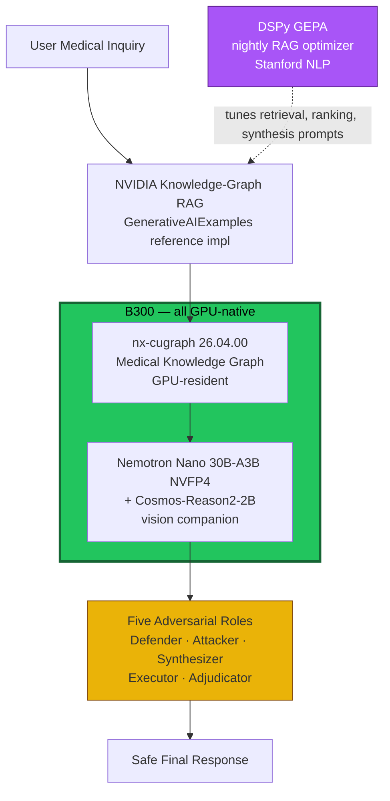

# Future Stack — North-Star Diagram

**Status:** research / forward-looking. **Not deployed.** The current
production surface is documented in `docs/pipeline-narrative.md`.

This diagram captures the user's proposed future architecture, with two
attribution corrections from the research briefs in this directory:

1. **Cosmos-Reason2-2B** is general-purpose physical AI; the medical
   fine-tune is *user's planned work*, not a public checkpoint.
2. **Karpathy's autoresearch optimizes LLM-training `val_bpb`, not RAG.**
   The recommended nightly RAG optimizer is **DSPy GEPA** (Stanford NLP),
   not a Karpathy artifact.

## Diagram

## Pinned versions (target state)

| Component | Version | Source |
|---|---|---|
| CUDA driver (host) | 13.2.1 | NVIDIA Blackwell Compatibility Guide |
| RAPIDS | 26.04 | rapids.ai |
| nx-cugraph | 26.04.00 (April 9, 2026) | rapidsai/nx-cugraph |
| vLLM | latest stable (v0.19.x line + B300 NVFP4 fixes) | vllm-project/vllm |
| Nemotron Nano | `nvidia/NVIDIA-Nemotron-3-Nano-30B-A3B-NVFP4` | huggingface.co/nvidia |
| Cosmos-Reason | `nvidia/Cosmos-Reason2-2B` (general-purpose; medical fine-tune planned, not public) | huggingface.co/nvidia |
| RAG framework | NVIDIA `GenerativeAIExamples/knowledge_graph_rag` | github.com/NVIDIA/GenerativeAIExamples |
| Nightly optimizer | DSPy GEPA | dspy.ai/api/optimizers/GEPA |

## Caveats per-brief

- **nx-cugraph at 3,987 nodes is below GPU break-even.** Diagram shows the
  intent, but actual healthcraft graph size today does not justify GPU
  acceleration. See `nx-cugraph-26.04.md`.
- **Cosmos-Reason2-2B medical fine-tune does not exist publicly.** Planned
  work, not a checkpoint. See `cosmos-reason2-2b.md`.
- **vLLM upgrade requires sandbox-first cutover** (NVFP4 CUDA-Graph
  regression at batch > 1 is a known risk on Blackwell). See
  `vllm-cuda-13.2.1.md`.
- **DSPy GEPA replaces "Karpathy Autoresearch" as the nightly RAG
  optimizer.** Karpathy's autoresearch optimizes language-model training,
  not retrieval. See `karpathy-autoresearch.md`.

## What's already deployed (do not confuse with the diagram)

- **Live LiveKit demo:** `https://prism42-app.thegoatnote.com/prism42/livekit`
  — Opus 4.7 LLM + Parakeet STT + Fish TTS on B300, vLLM 0.20 + CUDA 12.9.
- **Fallback ElevenLabs demo:** `https://prism42-console.vercel.app/prism42-v3`
  — Opus 4.7 via Anthropic API, no B300.

The future-stack diagram is the *next* iteration. Both deployed surfaces
remain in service through the transition.
