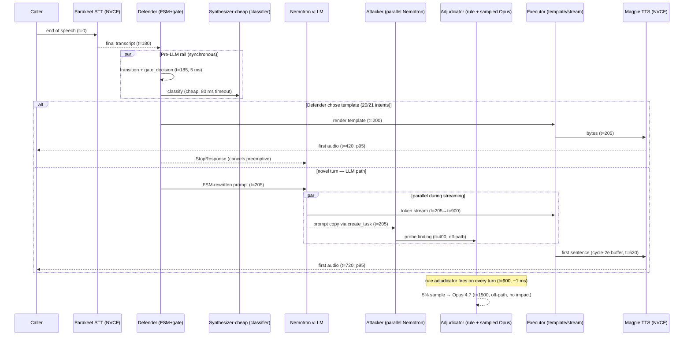

# voice-5role-design.md — keeping 5-role accountability under a 1100 ms voice budget

**Date:** 2026-04-27 · **Status:** design brief, no code touched · **Audience:** prism42 voice rail
**Companion to:** [`nvidia-voice-stack-architecture.md`](nvidia-voice-stack-architecture.md). Cites worker.py, orchestrator.py, specialists.py by line.

## 0. Frame

The archived `orchestrator_full.py` (133 lines, deprecated banner at orchestrator.py:1-13 and worker.py:744-746) ran the 5 roles as a serial tool-use chain: Opus 4.7 plans, 4 Sonnet specialists, Opus 4.7 STEP 2. Wall-clock 14-20 s. Fatal.

The single-LLM hot path that replaced it (orchestrator.py:597 `FAST_DISPATCHER_SYSTEM_PROMPT` + worker.py:710 vLLM Nemotron-Nano-30B-A3B BF16) is fast but mono-vocal: one model writes both the dialogue plan and the phrasing.

The 5-role pattern's *value* is generator/evaluator separation (CLAUDE.md "Recent best-practice synthesis", Anthropic harness-design taxonomy). The *cost* of the pattern was sequencing. The fix is to push each role onto the time-axis position where it both adds the safety value it was designed for and respects voice latency.

## 1. Time-axis taxonomy of the 5 roles

| Role | Time position | Module today | Latency budget | Reasoning |
|---|---|---|---|---|
| **Defender** | (a) pre-LLM input rail, synchronous | dispatcher_fsm.py + response_gate.py | ≤ 30 ms | Deterministic. Owns intent classification, pronoun discipline, anti-repetition latches, CPR-T-CPR gate. Already in production at orchestrator.py:414 (`fsm.transition`) and orchestrator.py:475 (`gate_decision`). Must complete before LLM kicks because it can short-circuit to template via `session.say()` + `StopResponse` (orchestrator.py:594). |
| **Attacker** | (b) preemptive parallel during LLM streaming | new `attacker.py` driven by Nemotron-Nano on a second vLLM slot (or shared concurrency=2) | budget invisible — runs async | Generates 1-2 adversarial probes per turn ("would the dispatcher's reply be exploitable if the caller is suicidal?", "does the reply leak gender?") and writes findings to a per-turn channel. Completes during or after LLM streaming; **never enters audio path**. |
| **Synthesizer** | (a) pre-LLM input rail (cheap) + (b) parallel during streaming (expensive variant) | structured_classifier.py (already shadow-mode at orchestrator.py:443-466) | ≤ 80 ms hot, async tail | Sub-LLM call (Nemotron classifier) that fuses caller utterance + transcript-so-far + alerts into a small structured perception. The cheap version is the existing shadow classifier (600 ms hard timeout, fire-and-forget). Promote it to feed FSM context but keep the timeout. |
| **Executor** | (a) pre-LLM input rail + streaming-output rail | response_gate template renderer (executor as scribe) + LiveKit preemptive_generation | ≤ 5 ms template / streaming with TTS | The Executor is the deterministic phrase-emitter: response_gate.py templates for 20/21 intents, LLM only for the irreducibly-novel turn. It already lives at orchestrator.py:474-541. Renaming the role makes the architecture legible; no code change required. |
| **Adjudicator** | (d) post-hoc audit (off-path) + sampled (5-10%) | claude_critic.py (Opus 4.7, off-path Pattern 6) | 750 ms hard timeout, NOT in voice budget | Opus 4.7 is too slow and too expensive to run on every turn. Run on every turn only the structlog-based fast adjudicator (rule-based: did Defender fire? did Executor template? did Attacker produce a probe?). Stochastically sample 5% of turns to claude_critic.score for full Opus 4.7 rubric. Audit log → Redis `prism42:adjudicator:<session>:<turn>`. |

Justification per role:
- **(a) for Defender/Synthesizer-cheap/Executor-template**: deterministic, sub-30-ms; safety value depends on running before bytes leave to TTS. Acceptable in p95 budget.
- **(b) for Attacker + Synthesizer-expensive**: their value is *judgment*, not *gating*. Run during the LLM stream so they finish around when first TTS audio plays, but never block.
- **(d) for Adjudicator**: 750 ms Opus 4.7 round-trip > entire voice budget. Off-path is the only way.

## 2. Hot path vs. cold critique — sampling policy

Every-turn (synchronous, in 1100 ms budget): Defender, Synthesizer-cheap, Executor.
Every-turn (parallel, fire-and-forget): Attacker, fast rule-based Adjudicator.
Sampled (5-10% of turns): Adjudicator-Opus-4.7 via claude_critic.

The trap orchestrator_full.py fell into was treating "5 roles" as "5 LLM calls per turn". The unlock is: 3 of the 5 are sub-LLM (FSM, classifier, template renderer); 1 is a parallel Nemotron probe, which shares the local vLLM server (worker.py:728) and benefits from cudagraph cache reuse — projected 60-120 ms on a 30B-A3B BF16 with concurrency=2; 1 is sampled cloud Opus that never blocks audio.

Cost ceiling: Attacker at ~50 input + 60 output tokens × every turn on local vLLM = $0. Adjudicator at 5% × 500 input + 120 output Opus 4.7 = ~$0.27 per 100 turns (claude_critic.py:60-62 confirms).

## 3. Mapping to existing prism42 code

| Role | Natural home | Edit shape |
|---|---|---|
| Defender | dispatcher_fsm.py:71 (`should_use_fsm`) + response_gate.py:55 — already canonical. | No edit; rename in docstrings. |
| Attacker | New module `agents/livekit/attacker.py` modeled on claude_critic.py shape (lazy-import, env-flag, fire-and-forget); called from orchestrator.py around line 466 in the same `asyncio.create_task` block as the shadow classifier. Backend = local vLLM Nemotron via httpx. |
| Synthesizer | structured_classifier.py (already loaded at orchestrator.py:295-304). Promote from "shadow only / log to UI" to "writes a `perception_summary` field that fsm.next_prompt(...) reads at orchestrator.py:554". Keep 600 ms timeout; on miss, FSM falls back to current behavior. |
| Executor | response_gate.py:80 `GateDecision` already is this. Templates at templates.py:1-359. Rename in comments only. |
| Adjudicator | claude_critic.py:1-75 already exists as Pattern 6. Add a fast in-process rule adjudicator (pure-Python, ≤ 1 ms) that runs every turn and writes a structured event; keep the Opus call sampled at `PRISM42_ADJUDICATOR_SAMPLE_RATE=0.05`. |

specialists.py 14-agent topology (specialists.py:14-25) is **not** the new home for the 5 roles. It is the cloud-Sonnet 4.6 substrate from cycle-2P that the FAST path replaced. Keep it loaded for the shadow auditor / qi-reviewer (post-session) only.

## 4. Sequence diagram — one caller turn, all 5 roles, with millisecond annotations

p95 budget kept: template path lands first audio ~420 ms, LLM path ~720 ms. Both under 1100 ms with margin for STT tail and TTS phoneme variability.

## 5. Failure modes

1. **A role hangs and blocks TTS.** Mitigation: Defender and Synthesizer-cheap have hard sync timeouts (FSM <30 ms by construction; classifier 600 ms in structured_classifier.py); Attacker/Adjudicator are `asyncio.create_task` with `asyncio.wait_for` wrappers and never awaited from the hot path — orchestrator.py:453 pattern.
2. **A role flags everything → 100% block rate.** Mitigation: Defender's gate_decision already has a `fallback_intent` field (response_gate.py:80, observable at orchestrator.py:528). Attacker findings are *advisory*, never gate audio. Adjudicator's Opus path is off-path, cannot block. Add a circuit breaker: if Defender blocks > 15% of turns over a 60 s window, log `defender.block_rate_excess` and route to LLM fallthrough.
3. **Adjudicator audit log floods Redis.** Mitigation: keys TTL 24 h; payload capped at 2 KB per turn (truncate cited utterances); only sample-flagged turns store full Opus rubric; rule-adjudicator turns store a 4-byte status. At 1k turns/day × 2 KB × 5% = 100 KB/day. Add `MAXMEMORY-POLICY allkeys-lru` to the prism42 Redis instance.
4. **Attacker generates jailbreak attempts that leak into the caller's audio.** Mitigation: Attacker output schema is `{"probe": str, "finding": str, "severity": str}` written *only* to structlog and dispatch_publisher; it is never appended to the LLM context window and never reaches `session.say()`. Reinforce by routing Attacker through a separate vLLM client object whose response is consumed by `attacker.py` and discarded — the Agent's `chat_ctx` is untouched. Add a unit test that asserts Attacker output never reaches `tts_node`.

## 6. What changes vs Phase 1 — touch list

worker.py:
- L800-850 (`AgentSession` construction): no change.
- L890-907 (classifier attach): generalize to "evaluator pack" — attach Attacker client and Adjudicator client identically.
- L900s on `metrics_collected`: extend to log `attacker.probe_ms`, `adjudicator.rule_ms`, `adjudicator.opus_sampled`.
- New env-flag plumbing only (no functional changes if flags off).

orchestrator.py:
- L443-466 (shadow classifier dispatch): widen to dispatch Attacker + rule-Adjudicator in same `create_task` block. Keep budgets independent.
- L554 (`fsm.next_prompt`): accept optional `perception` from Synthesizer when classifier returned in time; otherwise unchanged.
- L569 broad-except: unchanged — failures still fall back to FAST path.

response_gate.py: no edits; already is the Executor.
dispatcher_fsm.py: no edits; already is the Defender.
claude_critic.py: extend `score()` to accept the rule-adjudicator's findings as additional context; keep the Pattern-6 contract.

New files: `attacker.py`, `rule_adjudicator.py` (pure-Python, no SDK).

Env vars (all default OFF — preserves byte-equivalence):
- `PRISM42_ENABLE_ATTACKER=1`
- `PRISM42_ENABLE_RULE_ADJUDICATOR=1`
- `PRISM42_ADJUDICATOR_SAMPLE_RATE=0.05`
- `PRISM42_ATTACKER_TIMEOUT_MS=400`
- `PRISM42_ENABLE_CLAUDE_CRITIC=1` (already exists in claude_critic.py)

Verification (every claim ends with exit-0):
- `PRISM42_ENABLE_ATTACKER=1 python -m pytest agents/livekit/tests/test_attacker.py -k offpath`
- `python agents/livekit/bench_b300.py --concurrency 2 --turns 50 --report p95` (must show p95 < 1100 ms)
- `redis-cli --scan --pattern 'prism42:adjudicator:*' | wc -l` (must be ≤ 1k after a 100-turn run)

## 7. Honest scope cut — if 1100 ms p95 cannot hold all 5

Cut **Synthesizer-expensive** first. Reason: the cheap classifier already feeds FSM context within 80 ms. The "expensive" variant — a second LLM call that fuses Attacker findings + retrieval + intent into a richer perception — is the most ambitious and the one whose value is least demonstrated on PSAP turns where Defender's deterministic FSM already covers 20/21 intents.

If still over budget, sacrifice **Attacker**. Reason: Attacker findings are advisory and an off-path Opus 4.7 critic (the existing Adjudicator at claude_critic.py) covers the same ground at 5% sample rate. Losing Attacker means losing per-turn adversarial probing, which is real but not life-safety; losing Defender or Executor means losing the phrasing safety net, which is.

Order of preservation under pressure: Defender > Executor > Adjudicator-rule > Synthesizer-cheap > Adjudicator-Opus > Attacker > Synthesizer-expensive.

The architecture explicitly does **not** pretend that all 5 LLM-grade roles can run synchronously in 1100 ms. It pretends — accurately — that 3 deterministic roles plus 1 parallel local-LLM probe plus 1 sampled cloud audit can.
