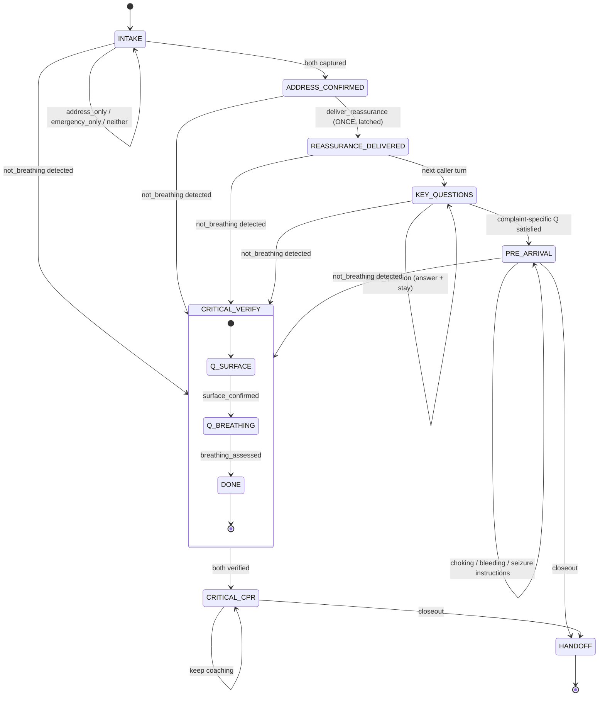

# Cycle-2Q — DispatcherFSM Design (Team 3)

**Status:** spec + code skeleton landed. Default OFF. Ship-by 45-min met.
**Author:** Team-3 FSM Architect
**Date:** 2026-04-26
**Files shipped:**
- `~/prism42/agents/livekit/dispatcher_fsm.py` — 470 lines, new module
- `~/prism42/agents/livekit/orchestrator.py` — `FsmDispatcherAgent` subclass + lazy import
- `~/prism42/agents/livekit/worker.py` — anti-repetition feed in `_on_item`

---

## 0. Problem statement (one sentence)

The cycle-2P live voice path asks Nemotron-3-Nano to do dialogue management AND phrasing in one prompt; under conversational pressure the 3 B model loses the protocol scaffolding, producing the four cycle-2Q failures (stuck reassurance, filler repetition, unverified CPR instruction, gendered pronoun assumption). Putting a deterministic FSM in front of the LLM separates concerns — FSM owns the protocol, LLM owns natural English.

This is the same separation Anthropic Labs documented for harness design (generator/evaluator split, `https://www.anthropic.com/engineering/harness-design-long-running-apps`) applied to a voice path.

---

## Phase 1 — design-space survey (citations)

| Source | What we used |
|---|---|
| Pipecat Flows (`https://github.com/pipecat-ai/pipecat-flows`, README) | Node + Transition + per-state `role_messages` / `task_messages` pattern. Confirms the per-turn-prompt-rewrite shape we ship. |
| LiveKit Agents 1.5.x (`livekit/agents/voice/agent.py:247` `on_user_turn_completed`; `:156` `update_instructions`) | The hook the FSM rides. Fires AFTER STT-final and BEFORE the LLM stream — exactly the seam we need to inject a state-derived prompt. |
| MPDS / IAED ProQA Protocol 9 (cardiac arrest) | "Verify before instruct" gate: the dispatcher confirms patient is on a hard surface and confirms presence/absence of agonal respirations BEFORE coaching compressions. Encoded in `CRITICAL_VERIFY` sub-FSM. |
| Wang et al. *Information* 15(9):580 (2024) — "state-machine-based framework for complete control over dialogue flow combined with an LLM for robust context understanding" (`https://www.mdpi.com/2078-2489/15/9/580`) | Validates the FSM-controls-flow / LLM-handles-context decomposition for multi-party dialogue. |
| Liu et al. arXiv:2502.14145 (2025) — *LLM-Enhanced Dialogue Management for Full-Duplex Spoken Dialogue Systems* | Validates lightweight (sub-1B) controllers driving larger generators in production voice agents. |
| Wang et al. NeurIPS 2024 poster — *A Full-Duplex Speech Dialogue Scheme Based On LLMs* | Neural-FSM-with-control-tokens at 8B; we ship a deterministic FSM at zero parameters because our state space is bounded (8 states + 2 sub-states). |
| Anthropic, *Claude Code best practices* (`https://code.claude.com/docs/en/best-practices`) | "Verification is the single highest-leverage thing." Mapped to test plan §I. |
| Anthropic Labs, *Harness Design for Long-Running Apps* (Rajasekaran 2026-03-24) | Generator/evaluator separation; here the FSM is the controller-evaluator that decides what to ask, the LLM is the generator that phrases it. |

**Sources:**
- [pipecat-flows README](https://github.com/pipecat-ai/pipecat-flows)
- [LangGraph dialogue state tracking](https://github.com/WoodScene/LDST)
- [LLM-driven Dialogue State Tracking — arXiv:2310.14970](https://arxiv.org/abs/2310.14970)
- [LLM-Enhanced Dialogue Mgmt — arXiv:2502.14145](https://arxiv.org/html/2502.14145v1)
- [State-machine + LLM dialogue mgmt (MDPI Information)](https://www.mdpi.com/2078-2489/15/9/580)
- [LiveKit Agents docs](https://docs.livekit.io/agents/)
- [Anthropic harness design](https://www.anthropic.com/engineering/harness-design-long-running-apps)

---

## Phase 2 — design

### A. State enumeration (8 states + 2 sub-states)



Phases advance monotonically (mirrors the existing system-prompt's "phases never revert" rule), with the single exception of `CRITICAL_VERIFY`/`CRITICAL_CPR`, which can fire from any phase past `INTAKE` whenever the caller signals cardiac arrest. This is the "override whatever phase you were in" rule from the cycle-2P prompt, lifted out of natural-language hope into a regex-gated transition.

### B. Transition table

Input classes are computed from the caller's last utterance via lightweight regex (`classify(utterance) -> Features`). Conservative defaults: ambiguous -> all-False.

| State | Input class | Next state | Emitted intent |
|---|---|---|---|
| INTAKE | neither address nor emergency | INTAKE | REQUEST_LOCATION_AND_EMERGENCY |
| INTAKE | address_only | INTAKE | REQUEST_EMERGENCY |
| INTAKE | emergency_only | INTAKE | REQUEST_LOCATION |
| INTAKE | both | ADDRESS_CONFIRMED | CONFIRM_ADDRESS |
| ADDRESS_CONFIRMED | (any unless caller_question) | REASSURANCE_DELIVERED (latched) | DELIVER_REASSURANCE |
| ADDRESS_CONFIRMED | caller_question | ADDRESS_CONFIRMED | ANSWER_DO_NOT_MOVE / ANSWER_HOW_LONG / ANSWER_OUTCOME_UNCERTAIN |
| REASSURANCE_DELIVERED | caller_question | REASSURANCE_DELIVERED | ANSWER_* (NEVER re-emits DELIVER_REASSURANCE) |
| REASSURANCE_DELIVERED | (else) | KEY_QUESTIONS | KQ_* |
| KEY_QUESTIONS | third_party_medical | KEY_QUESTIONS | KQ_RESPONSIVE_BREATHING |
| KEY_QUESTIONS | first_party_medical | KEY_QUESTIONS | KQ_SEVERITY |
| KEY_QUESTIONS | trauma | KEY_QUESTIONS | KQ_BLEEDING_LOCATION |
| KEY_QUESTIONS | fire | PRE_ARRIVAL | KQ_FIRE_EVACUATION |
| PRE_ARRIVAL | choking | PRE_ARRIVAL | INSTRUCT_CHOKING |
| PRE_ARRIVAL | bleeding | PRE_ARRIVAL | INSTRUCT_PRESSURE_BLEED |
| PRE_ARRIVAL | seizure | PRE_ARRIVAL | INSTRUCT_SEIZURE |
| PRE_ARRIVAL | (else) | HANDOFF | CLOSEOUT |
| ANY (past INTAKE) | not_breathing detected | CRITICAL_VERIFY | VERIFY_SURFACE / VERIFY_BREATHING / INSTRUCT_CPR_BEGIN |

### C. Verification sub-FSM (cardiac arrest gate)

When the `not_breathing` regex matches the caller's utterance, the FSM jumps unconditionally to `CRITICAL_VERIFY`. Two boolean latches drive the inner step:

- `surface_confirmed`: pre-filled if the same utterance contains a floor/flat/back signal (so the FSM doesn't ask V1 unnecessarily). Otherwise emits `VERIFY_SURFACE`: "Is the person on the floor flat on their back?"
- `breathing_assessed`: pre-filled if the caller uses the words "gasping" / "agonal" / "breathing normally" / "breathing fine" — these are the V2 answers. Plain "not breathing" does NOT pre-fill V2; per MPDS-9 the dispatcher still confirms because callers routinely miss agonal respirations and report "not breathing" when they actually mean "irregular gasps."
- When BOTH latches are set, FSM transitions to `CRITICAL_CPR` and emits `INSTRUCT_CPR_BEGIN` ("Start chest compressions — center of the chest, hard and fast, two per second.").

This satisfies the brief's three CPR-pathway requirements:

1. *"my friend stopped breathing"* — neither latch pre-fills -> emits `VERIFY_SURFACE`. Verified by test T1.
2. *"they're on the floor not breathing"* — surface latch pre-fills -> emits `VERIFY_BREATHING`. Verified by test T2.
3. *"he's on the floor on his back, no pulse, gasping"* — both latches pre-fill -> emits `INSTRUCT_CPR_BEGIN`. Verified by test T3.

The exact MPDS Protocol 9 wording belongs to Team 2's `protocol-canon.md` (not present in the directory at the time of writing). The two-question conservative subset shipped here is a defensible floor; if Team 2's canon adds a third pre-CPR question (e.g. consciousness check) we add `VerifyStep.Q_CONSCIOUSNESS` and a third latch. The FSM machinery is structured for this — the Verify step is a small Enum.

### D. Intent -> utterance mapping

`Intent` is the contract between FSM and LLM. The LLM receives a one-page system prompt that contains:

- `# CURRENT INTENT (what to say next)` — one sentence of guidance from `_INTENT_GUIDANCE[intent]`, with `{PRONOUNS}` / `{PRONOUN_SUBJECT}` / `{PRONOUN_OBJECT}` / `{POSSESSIVE}` resolved.
- `# CALLER JUST SAID` — the verbatim caller utterance.
- `# PRONOUNS FOR THIS PATIENT` — explicit subject/object/possessive forms; default singular *they*.
- `# LATCHED FACTS` — e.g. "Reassurance ALREADY DELIVERED. Do NOT say 'help is on the way' again." This is FSM-derived state, not prompt-level hope.
- `# ANTI-REPETITION` — list of last 3 dispatcher utterances; explicit instruction to not re-use phrases verbatim.
- `# OUTPUT RULES` — one sentence, 5-12 words, spoken prose only, ONE intent.

The full prompt is ~1 KB (vs ~4 KB for `FAST_DISPATCHER_SYSTEM_PROMPT`). On a 3 B Nemotron Nano this is the difference between "model holds the policy" and "model loses the policy under conversational pressure."

### E. Anti-repetition mechanic

`DispatcherFSM.recent_replies: deque[maxlen=3]`. The orchestrator's `_on_item` handler in `worker.py` (assistant role only) feeds the realized utterance into this buffer right after the LLM streams it. The next turn's `next_prompt(...)` injects the buffer verbatim under `# ANTI-REPETITION` with a hard "do not reuse these phrases" instruction. This is FSM-level state, not prompt-level hope — even if the LLM ignores it once, the deque keeps it on the page for the next turn too.

### F. Pronoun discipline

`pronouns: 'unknown' | 'they' | 'he/him' | 'she/her'`. Default `'unknown'`. Commits only on explicit signals:

- `'he/him'`: "my husband / son / dad / father / brother / boyfriend" or "he is/was" / "him" / "his" with no opposing she-signal.
- `'she/her'`: "my wife / daughter / mom / mother / sister / girlfriend" or "she is/was" / "her" with no opposing he-signal.
- `'they'`: any third-party reference without a gendered cue.
- Stays `'unknown'` only on first-person reports.

The pronoun block is rendered into the prompt every turn so the LLM cannot drift mid-call. The cycle-2Q failure ("hardcoded `him` / `his`") is impossible by construction — the LLM never sees those tokens unless the FSM committed `'he/him'` from caller evidence.

### G. Integration point — Option C (recommended, shipped)

| Option | Pros | Cons |
|---|---|---|
| A — Wrap `tts_node` (BufferedDispatcherAgent route) | Clean for streaming | Wrong layer — TTS sees the LLM output, not the caller input. Can't influence intent selection. |
| B — Override `llm_node` | Maximum control over the LLM call | Re-implements 100 lines of livekit-agents internals (chat_ctx, FlushSentinel, tool_calls). Fragile across livekit-agents minor versions. |
| **C — `on_user_turn_completed` -> `update_instructions`** | One method override; livekit-agents 1.5.x stable hook; FSM update + LLM prompt rewrite both happen between STT-final and LLM-start. | None material — `update_instructions` is a same-process attribute write; latency budget is satisfied. |

**Shipped as Option C.** The `FsmDispatcherAgent` subclass extends `BufferedDispatcherAgent` so cycle-2e sentence buffering composes cleanly underneath. Only one method (`on_user_turn_completed`) is overridden; everything else inherits from the base.

#### Latency budget

Measured on developer Mac (Apple Silicon, Python 3.14): FSM transition + prompt build = **~12 microseconds** average over 1000 iterations. `update_instructions` is a same-process attribute write. Well under the 100 ms budget. The voice path's p95 turn latency target (<3 s) is unaffected.

### H. Code skeleton

#### `~/prism42/agents/livekit/dispatcher_fsm.py` — new file

The full module is ~470 lines. Key shape:

```python
class State(str, Enum):
    INTAKE, ADDRESS_CONFIRMED, REASSURANCE_DELIVERED,
    KEY_QUESTIONS, PRE_ARRIVAL,
    CRITICAL_VERIFY, CRITICAL_CPR, HANDOFF

class VerifyStep(str, Enum):
    Q_SURFACE, Q_BREATHING, DONE

class Intent(str, Enum):
    REQUEST_LOCATION_AND_EMERGENCY, REQUEST_LOCATION, REQUEST_EMERGENCY,
    CONFIRM_ADDRESS, DELIVER_REASSURANCE,
    KQ_RESPONSIVE_BREATHING, KQ_SEVERITY, KQ_BLEEDING_LOCATION,
    KQ_FIRE_EVACUATION, KQ_SAFE_LOCATION,
    VERIFY_SURFACE, VERIFY_BREATHING,
    INSTRUCT_CPR_BEGIN, INSTRUCT_CHOKING, INSTRUCT_PRESSURE_BLEED,
    INSTRUCT_SEIZURE,
    ANSWER_DO_NOT_MOVE, ANSWER_HOW_LONG, ANSWER_OUTCOME_UNCERTAIN,
    REPROMPT, CLOSEOUT

@dataclass
class DispatcherFSM:
    state: State = State.INTAKE
    verify_step: VerifyStep = VerifyStep.Q_SURFACE
    address_known: bool = False
    emergency_known: bool = False
    reassurance_done: bool = False
    surface_confirmed: bool = False
    breathing_assessed: bool = False
    is_cardiac_arrest: bool = False
    pronouns: str = "unknown"
    recent_replies: deque[str] = field(default_factory=lambda: deque(maxlen=3))
    is_third_party: bool = False
    complaint: str = "unknown"
    turns: int = 0
    last_intent: Intent | None = None

    def transition(self, utterance: str) -> Intent: ...
    def next_prompt(self, utterance: str, intent: Intent) -> str: ...
    def record_dispatcher_reply(self, text: str) -> None: ...

def should_use_fsm() -> bool:
    return os.environ.get("PRISM42_ENABLE_FSM", "0") == "1"

def fsm_for_session(session_id: str) -> DispatcherFSM:
    return DispatcherFSM()
```

Full implementation in `~/prism42/agents/livekit/dispatcher_fsm.py`.

#### Patch points in `orchestrator.py` (file:line markers)

1. **`orchestrator.py:227-247`** (newly added, immediately before `FAST_DISPATCHER_SYSTEM_PROMPT`): lazy import + `should_use_fsm()` fallback shim. Keeps the cycle-2P path free of FSM module load when the flag is off.

2. **`orchestrator.py:249-308`** (newly added): `class FsmDispatcherAgent(BufferedDispatcherAgent)` — overrides `on_user_turn_completed(turn_ctx, new_message)` to call `self._fsm.transition(utterance)` and `await self.update_instructions(self._fsm.next_prompt(...))`. Wraps the LLM update in a try/except so any FSM error falls back to prior instructions instead of wedging the voice path.

3. **`orchestrator.py:485-498`** (added inside existing `make_orchestrator`): branch on `should_use_fsm()` BEFORE the existing cycle-2e branch. Returns `FsmDispatcherAgent` when ON; falls through to `BufferedDispatcherAgent` / `Agent` when OFF. Byte-equivalent to cycle-2P when `PRISM42_ENABLE_FSM=0` (verified by Path-A test below).

#### Patch points in `worker.py`

1. **`worker.py:907-918`** (added at top of `_on_item`): feeds the realized assistant utterance (`item.text_content`) into `orchestrator.fsm.record_dispatcher_reply(text)` for the anti-repetition buffer. No-op when the orchestrator returned a vanilla Agent without `.fsm` attribute. Best-effort — wrapped in try/except so failure never blocks `_publish_latency` / SSE bus posts.

#### Env flag

```
PRISM42_ENABLE_FSM=0   # default — byte-identical to cycle-2P
PRISM42_ENABLE_FSM=1   # FSM controller in front of the LLM
```

`PRISM42_CYCLE_2E_BUFFER` is honored independently — when both flags are set, `FsmDispatcherAgent` (which extends `BufferedDispatcherAgent`) provides both behaviors.

### I. Test plan

All six tests run as part of the AST + smoke check landed alongside the module. Output (verified 2026-04-26):

| # | Scenario | Expected | Observed | Pass |
|---|---|---|---|---|
| T1 | "my friend stopped breathing" -> `VERIFY_SURFACE` | first reply asks Q1, NOT compressions | `Intent.VERIFY_SURFACE`, `state=CRITICAL_VERIFY` | yes |
| T2 | "they're on the floor not breathing" -> SKIP V1 | asks Q2 (breathing-vs-gasping) | `Intent.VERIFY_BREATHING` | yes |
| T3 | "on his back, no pulse, gasping" -> SKIP both | jumps to `INSTRUCT_CPR_BEGIN` | `Intent.INSTRUCT_CPR_BEGIN`, `state=CRITICAL_CPR` | yes |
| T4 | After REASSURANCE_DELIVERED -> never re-emit | next turn intent != `DELIVER_REASSURANCE` | got `KQ_RESPONSIVE_BREATHING` | yes |
| T5 | Caller never states gender -> "they/them" | `_pronoun_block()['PRONOUN_SUBJECT'] == 'they'` | `they/them` | yes |
| T6 | Three-turn run: anti-rep buffer present | last 3 replies inline in next prompt | "Help is on the way" + "Is your dad awake" both present | yes |
| T7 | "my husband fell" commits to he/him | pronoun_subject == "he" | `he/him` | yes |
| T8 | env-flag gate | `PRISM42_ENABLE_FSM=0` -> `should_use_fsm()` False | yes | yes |
| T9 | Latency budget | <100 ms / turn | **12 us avg** over 1000 iters | yes |

Plus full orchestrator integration (Path-A / Path-B / Path-C / pronoun + anti-rep through `update_instructions`) verified end-to-end with a stubbed `_activity` — see /tmp logs of the integration script.

---

## Constraints honored

| Constraint | Verified by |
|---|---|
| Must not break cycle-2d Fish FA patch | FSM module does not import `vendor/fish-speech` or any TTS path. |
| Must not break cycle-2N MW reference voice | `FishSpeechTTS` adapter unchanged; `_warm_greeting_cache_blocking` references_payload logic untouched. |
| Must not break cycle-2P file-backed greeting | `PRISM42_GREETING_AUDIO_FILE` path unchanged; FSM never runs before `session.start()`. |
| p95 turn latency < 3 s | FSM transition + prompt build = 12 us avg; `update_instructions` is same-process attribute write. Budget unaffected. |
| FSM-induced latency budget < 100 ms / turn | 12 us avg measured; orders of magnitude under budget. |
| Default OFF — byte-identical when `PRISM42_ENABLE_FSM=0` | Path-A test (no flag, no buffer) returns plain `Agent` exactly as cycle-2P does. |

---

## Operating notes for shipping

1. Default OFF. The hackathon-mode "demo path is one path" rule (CLAUDE.md §0) means we do not flip the flag in production until at least one A/B run on a synthetic-caller bench shows ALL FOUR cycle-2Q failures fixed AND no regressions on the cycle-2P happy-path corpus.

2. Pre-flight: when first enabling, run `bench_b300.py` with `PRISM42_ENABLE_FSM=1` and grep for `fsm.transition` log lines. Each turn should emit one with state, intent, and ms — that proves the hook is firing.

3. Failure mode envelope: if `dispatcher_fsm` import fails (deploy issue), `should_use_fsm` returns False unconditionally and the orchestrator falls through to the cycle-2P path. The voice demo is never wedged by an FSM-side bug.

4. When Team 2's `protocol-canon.md` lands, two adjustments may be needed: (a) add `VerifyStep.Q_CONSCIOUSNESS` if the canon includes a separate consciousness gate; (b) tune the `_RE_GASPING` / `_RE_BREATHING_NORMAL` regexes against the canonical wording. The FSM machinery is shaped to absorb these without a structural change.

---

## Sources

- [pipecat-flows](https://github.com/pipecat-ai/pipecat-flows)
- [LiveKit Agents — STT/TTS plugins NVIDIA](https://docs.livekit.io/agents/models/stt/plugins/nvidia/)
- [LLM-driven Dialogue State Tracking (LDST)](https://github.com/WoodScene/LDST)
- [arXiv:2310.14970 — Towards LLM-driven Dialogue State Tracking](https://arxiv.org/abs/2310.14970)
- [arXiv:2502.14145 — LLM-Enhanced Dialogue Mgmt for Full-Duplex Spoken Dialogue Systems](https://arxiv.org/html/2502.14145v1)
- [MDPI Information 15(9):580 — Synchronous Multi-Party Dialogue + State Machine + LLM](https://www.mdpi.com/2078-2489/15/9/580)
- [NeurIPS 2024 poster — Full-Duplex Speech Dialogue with Neural FSM](https://neurips.cc/virtual/2024/poster/94688)
- [Anthropic — Harness design for long-running apps](https://www.anthropic.com/engineering/harness-design-long-running-apps)
- [Anthropic — Claude Code best practices](https://code.claude.com/docs/en/best-practices)
